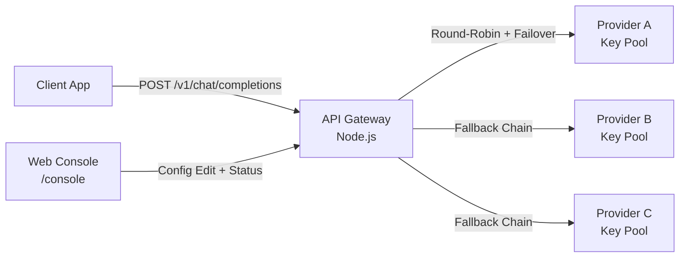
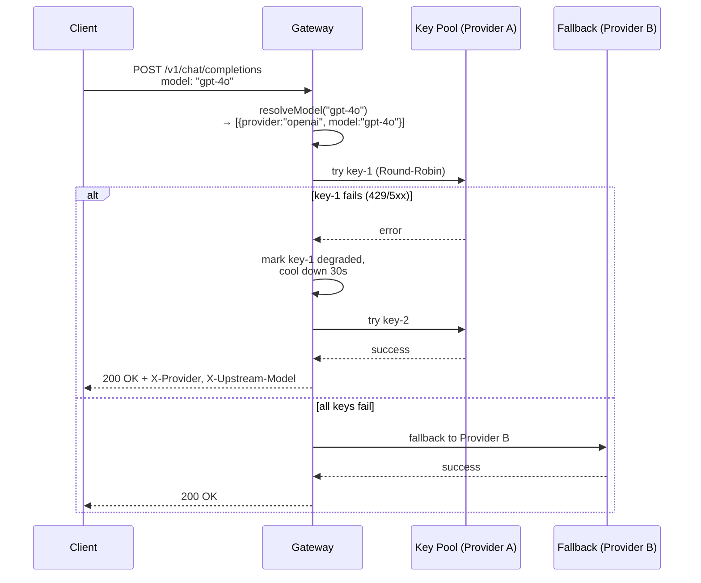

# API Gateway

> AI API Gateway — Multi-Key Polling, Failover, Model Alias Routing, SSE Streaming

Client → Proxy (Node.js) → 上游 Provider。單一端點管理多個 LLM Provider 的金鑰輪詢、故障轉移與模型路由。

---

## Architecture



### Request Flow



---

## Features

### Key Management
| Feature | Description |
|---------|-------------|
| **Multi-Key Polling** | Per-provider Round-Robin across API keys |
| **Key Health Tracking** | Tracks per-key success/failure/latency/cool-down |
| **Automatic Degradation** | 429/5xx/network error → key enters cool-down, retries after `cooldown_sec` |
| **Gradual Recovery** | After cool-down, uses degraded keys at reduced rate, restores on success |

### Provider Resilience
| Feature | Description |
|---------|-------------|
| **Fallback Chain** | Model maps to ordered `[{provider,model}]` — first provider's keys exhausted → next |
| **Circuit Breaker** | 5 consecutive 5xx skips provider for 30s; immediately resets on success |
| **Per-Key RPM/TPM Limit** | `rate_limit` and `tpm_limit` per key configurable |

### Model Routing
| Feature | Description |
|---------|-------------|
| **Model Alias** | Map friendly names to `[{provider,model}]` chains |
| **Endpoint Auto-Dispatch** | `endpoint_fallbacks` resolves unknown model names by endpoint path |
| **Vision Auto-Route** | Requests with `image_url` automatically switch to `vision` alias |
| **Context Window Sorting** | Models sorted by token limit for optimal alias selection |

### Streaming & Endpoints
| Feature | Description |
|---------|-------------|
| **SSE Streaming** | Transparent upstream passthrough, rewrites model name back to client's original |
| **Chat Completions** | `POST /v1/chat/completions` |
| **Non-Chat Endpoints** | embeddings, images, audio/speech, audio/transcriptions, audio/translations, files |
| **TTS Format Translation** | Built-in Cartesia & ElevenLabs format conversion |

### Management Console
| Feature | Description |
|---------|-------------|
| **Web Dashboard** | `GET /console` — login with client-token |
| **Live Config Editor** | Edit config.json with CodeMirror, auto-restart on save |
| **Log Viewer** | Browse log.json with date/type filters |
| **Real-Time Status** | SSE-pushed provider health, latency, HTTP code breakdown |
| **Provider Probe** | Ping provider base URL to check connectivity |
| **Theme Toggle** | Dark/Light mode with persist |

---

## Quick Start

### Prerequisites
- Node.js 18+ or Bun
- API keys for your target providers

### Setup

```bash
# Clone & install dependencies
git clone https://github.com/ss-vip/api-gateway.git
cd api-gateway
npm install

# Configure
cp src/config.example.json src/config.json
# Edit src/config.json — set client_token and provider apiKeys

# Start
npm start
```

### Verify

```bash
curl http://localhost:3000/health
# → {"ok":true,"uptime":"..."}
```

### Call

```bash
curl http://localhost:3000/v1/chat/completions \
  -H "Authorization: Bearer $YOUR_CLIENT_TOKEN" \
  -d '{"model":"openai","messages":[{"role":"user","content":"Hello"}],"stream":true}'
```

---

## HTTP API

### Endpoints

| Method | Path | Description |
|--------|------|-------------|
| `POST` | `/v1/chat/completions` | Chat completions (OpenAI-compatible) |
| `POST` | `/v1/embeddings` | Text embeddings |
| `POST` | `/v1/images/generations` | Image generation |
| `POST` | `/v1/images/edits` | Image editing (multipart) |
| `POST` | `/v1/images/variations` | Image variation (multipart) |
| `POST` | `/v1/audio/speech` | Text-to-speech |
| `POST` | `/v1/audio/transcriptions` | Speech-to-text |
| `POST` | `/v1/audio/translations` | Speech translation |
| `GET/POST/DELETE` | `/v1/files` | File management |
| `GET` | `/health` | Health check |
| `GET` | `/console` | Management dashboard |

### Response Headers (non-streaming)
- `X-Provider` — Actual provider used
- `X-Upstream-Model` — Actual model called upstream

---

## Configuration

Config file at `src/config.json` or `src/config.jsonc` (supports `//` and `/* */` comments, trailing commas).

### Minimal Config

```jsonc
{
  "client_token": "sk-your-secret-token",
  "providers": {
    "openai": ["sk-openai-key-1", "sk-openai-key-2"],
    "mistral": ["sk-mistral-key-1"]
  },
  "models": {
    "gpt-4o": [
      { "provider": "openai", "model": "gpt-4o" },
      { "provider": "mistral", "model": "mistral-large-latest" }
    ]
  }
}
```

### Custom Provider

```jsonc
"providers": {
  "my-proxy": {
    "apiKeys": ["sk-xxxx"],
    "baseUrl": "https://my-proxy.example.com",
    "pathPrefix": "/v1",
    "rpm": 20
  }
}
```

### Environment Variable Override

Any config value can be overridden by an uppercased environment variable:
```bash
export CLIENT_TOKEN="sk-override-token"
export PORT="8080"
```

### Endpoint Auto-Dispatch

Client sends a single model name; gateway routes by endpoint:

```jsonc
{
  "endpoint_fallbacks": {
    "/v1/chat/completions":      "gpt-4o",
    "/v1/images/generations":    "dall-e-3",
    "/v1/audio/speech":          "tts-1",
    "/v1/audio/transcriptions":  "whisper-1",
    "/v1/embeddings":            "text-embedding-3-small",
    "/v1/files":                 "file-store"
  }
}
```

All fields documented in `src/config.example.json`.

---

## Deployment

### PM2 (Production)

```bash
npm install -g pm2
pm2 start src/index.js --name api-gateway \
  --node-args="--max-old-space-size=192" \
  --max-memory-restart 300M \
  --exp-backoff-restart-delay 10000 \
  --kill-timeout 10000
pm2 save && pm2 startup
```

### Serv00 (Free Tier)

Serv00 provides 256MB RAM, Node.js 18+, cron jobs.

1. Upload project to `~/domains/your-domain/public_nodejs/`
2. Set env via `package.json` or `config.json`
3. Create a cron job to keep the process alive:

```bash
# Cron: every 5 minutes
curl -s http://localhost:3000/health > /dev/null || \
  (cd ~/domains/your-domain/public_nodejs && node src/index.js &)
```

4. Set `PORT` env to the assigned port, `CONFIG_PATH` to absolute path

### Runtime Support

| Runtime | Support | Command |
|---------|---------|---------|
| Node.js 18+ | ✅ | `npm start` or `node src/index.js` |
| Bun | ✅ | `npm run bun` or `bun run src/index.js` |

---

## Supported Providers

Any OpenAI Chat Completions-compatible endpoint:

`openai` `mistral` `cerebras` `deepseek` `xai` `groq` `together` `openrouter` `cohere` `perplexity` `huggingface` `pollinations` `literouter` `llm7` `nvidia` `gpt4free` `agnes-ai` `sea-lion` `kilo` `replicate` `baseten` `parallel` `cartesia` `elevenlabs` `morph`

Built-in TTS format conversion for **Cartesia** & **ElevenLabs**.

---

## Logs

- Default location: `log.json` in project root (configurable via `log.path`)
- Retention: 7 days (configurable via `log.retention_days`)
- Format: JSON lines — `{ts, id, provider, model, key, type, latency, tokens, status, error}`
- Cleanup: automatic on every 50th write + `/health` hourly scan
- Filterable by date range and success/error in web console

---

## Development

### Project Structure

```
api-gateway/
├── src/
│   ├── config.example.json   # Config template
│   ├── console.html          # Web management console
│   └── index.js              # Main application
├── docs/                     # GitHub Pages
│   ├── _config.yml
│   └── index.md
├── package.json
└── README.md
```

### Node.js Memory

```bash
# Memory-limited startup (recommended for free tier)
node --max-old-space-size=128 src/index.js
```

---

## License

MIT
